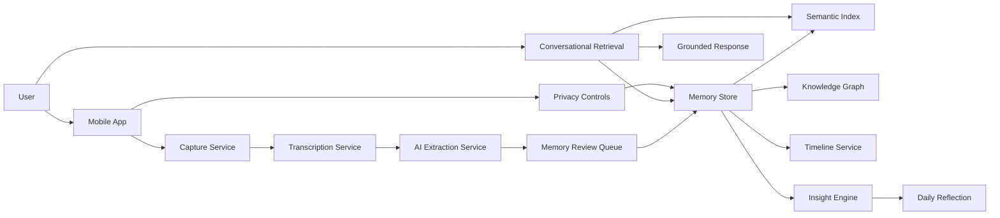

# LifeOS AI Terms of Reference

Version: 1.0  
Date: May 22, 2026  
Project: LifeOS AI  
Document Owner: Product Management  
Audience: Founders, Product, Design, Engineering, AI, Security, QA, Operations

## 1. Document Purpose

This Terms of Reference defines the scope, objectives, working assumptions, deliverables, and quality standards for the LifeOS AI product documentation and product build planning.

LifeOS AI is a personal AI life operating system. It is designed to help a user capture fragments of life, convert those fragments into structured memory, and use AI to surface summaries, patterns, insights, and personal reflections over time.

This TOR is the source agreement for what the documentation package must cover before detailed design, engineering estimation, and implementation begin.

## 2. Project Background

Most personal productivity tools treat life information as isolated notes, tasks, chats, journal entries, or calendar events. Users often capture thoughts in scattered places, forget important decisions, lose emotional context, and struggle to understand long-term personal patterns.

LifeOS AI addresses this by becoming a private memory layer for a person's life. The application captures voice thoughts, text reflections, events, decisions, moods, goals, habits, conversations, and daily experiences. AI then organizes these into structured memories, timelines, semantic relationships, and insight reports.

The product should feel less like a chatbot and more like a second mind that quietly learns from the user, remembers what matters, and helps the user reflect with clarity.

## 3. Product Definition

### 3.1 What LifeOS AI Is

LifeOS AI is:

| Product Identity | Meaning |
|---|---|
| Personal life operating system | A system for capturing, organizing, and understanding personal life data |
| AI memory layer | A structured long-term memory built from user inputs |
| Reflection engine | A system that generates daily summaries and deeper personal insights |
| Semantic life timeline | A chronological view of events, moods, goals, decisions, and milestones |
| Personal knowledge graph | A connected model of people, places, goals, emotions, events, and memories |
| Private second mind | A user-owned system designed to support self-understanding |

### 3.2 What LifeOS AI Is Not

LifeOS AI is not:

| Not This | Reason |
|---|---|
| A generic chatbot | Chat is only one interface for retrieval and reflection |
| A notes app | Notes are raw inputs, but the core value is structured memory and insight |
| A task manager | Actions may be extracted, but task management is not the primary product |
| A social app | The product is private by default and not built around sharing |
| A medical or therapy product | It may support reflection, but must not diagnose or treat mental health conditions |
| A surveillance tool | Passive context must be transparent, consent-based, and user-controlled |

## 4. Project Objectives

The project objectives are:

1. Define the complete product documentation foundation for LifeOS AI.
2. Clarify the MVP scope and separate it from future evolution.
3. Define the user experience for capturing, reviewing, searching, editing, and reflecting on life memories.
4. Define the conceptual AI memory system, including extraction, summarization, retrieval, and insight generation.
5. Define privacy, security, user control, and ethical boundaries.
6. Provide enough detail for design teams to create wireframes and prototypes.
7. Provide enough detail for engineering teams to estimate and implement major workflows.
8. Provide testable acceptance criteria and quality expectations for core features.

## 5. Scope of Work

### 5.1 In Scope

The documentation package must cover:

| Area | Required Coverage |
|---|---|
| Product strategy | Vision, problem, target users, value proposition, MVP definition |
| User experience | Navigation, screens, user flows, journey maps, interaction principles |
| AI behavior | Memory extraction, summarization, insight generation, retrieval, confidence handling |
| Memory system | Memory types, lifecycle, editing, deletion, search, semantic links |
| Timeline | Chronological events, moods, decisions, milestones, filters, drill-down |
| User stories | Detailed stories with acceptance criteria and examples |
| System design | Conceptual architecture, services, data flow, APIs, workflows |
| Data design | Conceptual entities, relationships, metadata, consent status, audit fields |
| Privacy and security | Encryption, authentication, permissions, data ownership, deletion, export |
| Ethics | AI boundaries, emotional safety, transparency, bias, user autonomy |
| Testing | Functional, AI quality, privacy, security, performance, regression testing |
| Operations | Monitoring, support, maintenance, incidents, model updates |
| Roadmap | MVP, V2, V3, and long-term personal intelligence evolution |

### 5.2 Out of Scope

The current documentation phase excludes:

| Exclusion | Explanation |
|---|---|
| Production source code | This phase documents product behavior and architecture only |
| High-fidelity UI designs | Screen descriptions and UX specifications are included, final visual mockups are not |
| Vendor-specific implementation | Architecture remains conceptual unless a stack is later confirmed |
| Legal policy drafting | Privacy requirements are documented, but final legal text requires counsel |
| Clinical or therapeutic claims | The product must avoid medical positioning |
| Financial forecasting | Revenue, pricing, and cost modeling are separate business documents |

## 6. Stakeholders

| Stakeholder | Responsibility |
|---|---|
| Founder / Executive Sponsor | Owns vision, prioritization, and investment decisions |
| Product Manager | Owns requirements, roadmap, scope, and acceptance criteria |
| UX Designer | Owns interaction design, screen structure, and usability |
| Mobile Engineer | Builds mobile app capture, timeline, search, and account flows |
| Backend Engineer | Builds APIs, storage, memory services, and integrations |
| AI Engineer | Builds extraction, summarization, retrieval, ranking, and insight workflows |
| Security Engineer | Reviews encryption, permissions, access control, and privacy posture |
| QA Engineer | Builds test plans and validates acceptance criteria |
| Operations / Support | Handles user support, incidents, monitoring, and maintenance processes |

## 7. Target Users

### 7.1 Primary User Groups

| User Group | Description | Primary Need |
|---|---|---|
| Reflective professionals | Busy people who want to understand decisions, stress, goals, and work patterns | Fast capture and useful recall |
| Founders and builders | People with many decisions, meetings, ideas, and emotional highs/lows | Memory of goals, decisions, and progress |
| Self-improvement users | Users tracking habits, moods, productivity, identity, and personal growth | Pattern detection and reflection |
| Journaling users | Users who already write or voice dump but want structure and insight | AI-organized life records |
| Neurodivergent or overwhelmed users | Users who benefit from low-friction external memory support | Simple capture and searchable recall |

### 7.2 Secondary User Groups

| User Group | Description | Primary Need |
|---|---|---|
| Coaches or mentors using personal notes | Users documenting client-adjacent reflections for themselves | Private organization and retrieval |
| Students | Users capturing study reflections, goals, decisions, and life changes | Timeline and goal memory |
| Caregivers | Users tracking emotional load, routines, and important life events | Daily summaries and memory recall |

## 8. Product Principles

| Principle | Requirement |
|---|---|
| Privacy first | Default experience must protect sensitive personal data |
| User ownership | Users can view, edit, export, and delete their data |
| Transparent memory | Users can see what the system remembered and how it interpreted inputs |
| Low-friction capture | Voice and quick text capture must be available within seconds |
| Grounded AI | Answers must be based on stored memories, not unsupported invention |
| User control over AI | Users can correct memories, reject insights, and disable features |
| Emotional safety | The product must avoid judgmental, diagnostic, or manipulative language |
| Long-term usefulness | The system must become more valuable as life data accumulates |
| Minimal UI burden | The app should be simple enough to use daily without setup fatigue |

## 9. MVP Definition

The MVP should prove that users can capture life fragments, trust the AI to structure them, retrieve memories, and receive useful daily reflections.

### 9.1 MVP Features

| Feature | MVP Requirement |
|---|---|
| Account and onboarding | Create account, explain privacy, set consent, choose basic preferences |
| Voice thought capture | Record voice, transcribe, extract structured memory candidates |
| Quick text capture | Add short or long text entries |
| Memory review | Show extracted memory summary, emotion, people, events, actions, and tags |
| Memory editing | User can edit, correct, merge, archive, or delete memories |
| Life timeline | Show memories chronologically with filters for mood, people, goals, and events |
| Daily reflection | Generate daily summary from captured memories |
| Conversational retrieval | User asks questions and receives grounded answers with memory references |
| Semantic search | Search memories by meaning, not only exact keywords |
| Privacy controls | Export data, delete data, manage AI processing consent |

### 9.2 MVP Success Metrics

| Metric | Target Signal |
|---|---|
| Activation | User captures first memory within onboarding session |
| Capture habit | User captures at least 4 days in first 7 days |
| Review trust | User accepts or lightly edits most AI-generated memory summaries |
| Retrieval value | User successfully finds a past memory using natural language |
| Reflection value | User reads or saves at least one daily reflection per week |
| Privacy confidence | User can locate data controls without support |

## 10. Future Scope

| Phase | Future Capability |
|---|---|
| V2 | Proactive insights, goal tracking, recurring pattern reports, calendar integration |
| V2 | Advanced personal knowledge graph with relationship explanations |
| V2 | Context-aware weekly and monthly life reviews |
| V3 | Behavior model that learns personal cycles, stressors, values, and decision patterns |
| V3 | AI self-memory that maintains a long-term model of the user's evolving identity |
| V3 | Private agentic suggestions with user-approved actions |

## 11. Conceptual System Boundaries

## 12. Key Deliverables

| Deliverable | Description |
|---|---|
| Terms of Reference | Defines scope, standards, objectives, and boundaries |
| User Flow Specification | Step-by-step mobile workflows for core experiences |
| User Stories and Acceptance Criteria | Product backlog-ready stories with expected behavior |
| Future Full Product Spec | Complete product documentation package across product, UX, system, privacy, testing, and operations |

## 13. Documentation Standards

All product documentation must be:

| Standard | Requirement |
|---|---|
| Detailed | Each feature must include purpose, behavior, states, and expected outcomes |
| Testable | Acceptance criteria must support QA validation |
| Actionable | Engineering and design teams should be able to use it directly |
| Consistent | Core terms must be reused consistently |
| Privacy-aware | Every data-handling feature must consider consent and control |
| AI-aware | AI features must include confidence, review, correction, and failure handling |
| Mobile-first | UX documentation must prioritize mobile interaction patterns |

## 14. Core Terminology

| Term | Definition |
|---|---|
| Raw capture | Original user input such as audio, transcript, or typed text |
| Memory | A structured record extracted from raw capture or manually created |
| Memory candidate | AI-generated memory awaiting user review or automatic approval rules |
| Event | A time-bound occurrence in the user's life |
| Reflection | A generated summary or interpretation of a day, week, theme, or period |
| Insight | AI-detected pattern or observation grounded in multiple memories |
| Entity | A person, place, organization, project, goal, emotion, habit, or topic |
| Knowledge graph | Connected representation of entities and memories |
| Timeline | Chronological view of events, memories, moods, decisions, and milestones |
| Grounded answer | AI response supported by stored user memories and references |

## 15. Assumptions

| Assumption | Impact |
|---|---|
| Mobile-first product | Core capture and review flows must be fast and thumb-friendly |
| Voice is a primary input | Transcription and correction UX are critical |
| User data is sensitive | Encryption, deletion, and transparent consent are core requirements |
| AI output may be imperfect | Review, edit, and confidence patterns are required |
| Early users may not have much data | MVP must provide value even with sparse memory history |
| Long-term value depends on trust | Privacy controls and explainability must be visible |

## 16. Constraints

| Constraint | Product Response |
|---|---|
| Voice transcription errors | Provide transcript review and memory correction |
| AI hallucination risk | Ground answers in stored memories and show references |
| Data sensitivity | Apply encryption, access controls, and user-managed deletion |
| User friction | Keep capture to one tap from home screen |
| Cost of AI processing | Use staged processing, batching, and priority queues |
| Emotional vulnerability | Avoid clinical claims and use careful language |
| Data volume growth | Use semantic indexing, metadata filters, and pagination |

## 17. Risk Register

| Risk | Severity | Likelihood | Mitigation |
|---|---:|---:|---|
| User does not trust AI memory | High | Medium | Transparent review queue, editable memory, source links |
| AI invents unsupported insight | High | Medium | Require evidence references and confidence labels |
| Sensitive data exposure | Critical | Low to Medium | Encryption, access control, audit logs, security review |
| Capture habit does not form | High | Medium | One-tap capture, reminders, daily reflection value loop |
| Product feels too complex | High | Medium | Simple home screen, progressive disclosure, minimal setup |
| Over-personalized AI feels invasive | High | Medium | Consent controls, proactive insight settings, explainability |
| Poor retrieval quality | High | Medium | Hybrid semantic and metadata search with feedback loop |
| Deletion is incomplete | Critical | Low | Hard deletion workflows, deletion audit, index cleanup |

## 18. Approval Criteria

This TOR is approved when stakeholders agree that:

1. The product definition is accurate.
2. The scope includes the required documentation areas.
3. MVP boundaries are acceptable.
4. Privacy and user control are treated as core requirements.
5. AI behavior will be documented with transparency and correction paths.
6. The next documentation deliverables can proceed using this TOR as the baseline.

## 19. Next Documentation Steps

After this TOR, the next documents are:

1. Detailed user flow specification.
2. Complete user stories and acceptance criteria.
3. Full product requirements document.
4. UX screen specification.
5. Conceptual system architecture and data model.
6. AI memory and insight behavior specification.
7. Security, privacy, testing, and operations documentation.
