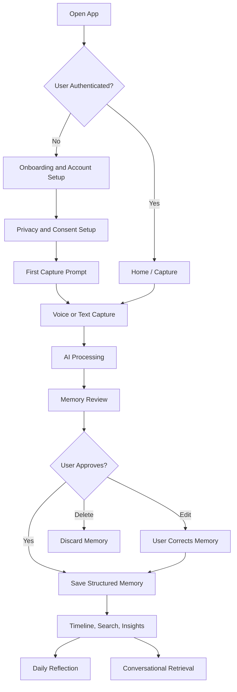
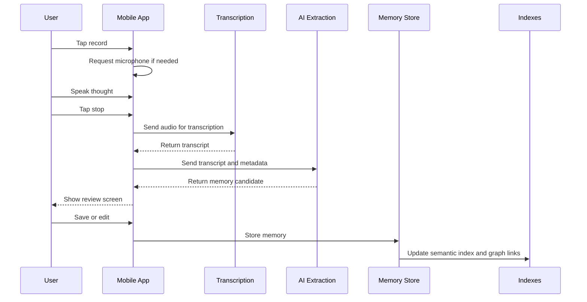

# LifeOS AI User Flow Specification

Version: 1.0  
Date: May 22, 2026  
Project: LifeOS AI  
Audience: Product, UX, Mobile Engineering, Backend Engineering, AI Engineering, QA

## 1. Purpose

This document defines detailed user flows for LifeOS AI. Each flow describes the user's intent, entry points, screens, system behavior, AI behavior, error states, and expected outcomes.

LifeOS AI must feel simple on the surface while performing sophisticated structuring, indexing, summarization, and retrieval in the background.

## 2. Core Navigation Model

### 2.1 Primary Tabs

| Tab | Purpose | Main User Actions |
|---|---|---|
| Capture | Record voice or type a life fragment | Start recording, type thought, save capture |
| Timeline | Browse life chronologically | View memories, filter, open details |
| Ask | Retrieve memory conversationally | Ask questions, inspect sources |
| Insights | Review daily summaries and patterns | Read reflections, confirm or dismiss insights |
| Settings | Manage privacy, account, memory, export | Consent, deletion, export, security |

### 2.2 Global Actions

| Action | Available From | Behavior |
|---|---|---|
| Quick voice capture | Home/Capture tab and optional widget | Opens recorder immediately |
| Quick text capture | Capture tab | Opens text input |
| Search | Timeline and Ask | Searches memories semantically |
| Add correction | Memory detail, AI answer, insight | Lets user correct AI interpretation |
| Delete memory | Memory detail, settings data manager | Removes memory and related indexes |

## 3. High-Level Product Flow

## 4. Flow 1: First-Time Onboarding

### 4.1 User Goal

The user wants to understand what LifeOS AI does, create an account, set privacy preferences, and capture the first memory without feeling overwhelmed.

### 4.2 Entry Points

| Entry Point | Trigger |
|---|---|
| App launch | User opens app after installation |
| Invitation link | User opens a shared beta or waitlist invite |
| Post-signup redirect | User returns after email or SSO authentication |

### 4.3 Flow Steps

| Step | Screen | User Action | System Behavior | AI Behavior |
|---:|---|---|---|---|
| 1 | Welcome | Taps Get Started | Shows short product promise | None |
| 2 | Product framing | Reads what app remembers | Explains capture, memory, insight, user control | None |
| 3 | Account creation | Chooses email, phone, SSO, or passkey | Creates account session | None |
| 4 | Privacy promise | Reviews privacy principles | Shows data ownership, deletion, export, AI processing notes | None |
| 5 | Consent setup | Accepts required consent and selects optional AI features | Saves consent profile | None |
| 6 | Memory preferences | Selects capture reminders, tone, sensitive topic handling | Saves preferences | None |
| 7 | First capture prompt | Chooses voice or text | Opens capture interface | Prepares processing pipeline |
| 8 | First memory review | Reviews AI extracted memory | Displays summary, emotions, tags, actions, entities | Extracts structure from input |
| 9 | Completion | Taps Save Memory | Stores memory and shows timeline placement | Indexes memory |

### 4.4 Required Screens

| Screen | Required Content |
|---|---|
| Welcome | App name, concise positioning, Get Started |
| Product framing | "Capture your life. Understand it over time." style explanation |
| Account | Authentication options and terms link |
| Privacy | Data ownership, edit/delete/export controls, AI processing disclosure |
| Consent | Required consent, optional personalization, proactive insight toggle |
| First capture | Voice and text options with minimal instruction |
| Memory review | AI summary, original transcript/text, extracted entities, save/edit/delete |

### 4.5 Success Criteria

1. User can complete onboarding in under 3 minutes.
2. User can skip non-essential preferences.
3. User captures first memory before reaching a blank dashboard.
4. User understands that AI-generated memories are editable.
5. User can access privacy settings after onboarding.

### 4.6 Edge Cases

| Edge Case | Expected Handling |
|---|---|
| User abandons onboarding | Resume at last completed step |
| Authentication fails | Show retry and alternative sign-in method |
| User declines required consent | Explain required data processing and block account activation |
| User declines optional personalization | App works with basic memory features only |
| First AI extraction fails | Save raw capture and offer retry |

## 5. Flow 2: Voice Thought Capture

### 5.1 User Goal

The user wants to speak naturally and have the app turn the spoken thought into a useful structured memory.

### 5.2 Flow Diagram

### 5.3 Flow Steps

| Step | Screen / State | User Action | System Behavior | AI Behavior |
|---:|---|---|---|---|
| 1 | Capture tab | Taps microphone | Opens recorder and checks permission | None |
| 2 | Permission prompt | Grants microphone access | Starts recording | None |
| 3 | Recording | Speaks naturally | Shows duration, waveform, pause/stop controls | None |
| 4 | Recording | Taps stop | Saves local temporary audio | None |
| 5 | Processing | Waits or leaves screen | Uploads audio securely if cloud processing is enabled | Transcribes audio |
| 6 | Transcript review | Reviews transcript | Shows editable transcript | None |
| 7 | Memory extraction | Taps Continue or auto-processes | Sends transcript to extraction service | Extracts summary, emotions, entities, events, actions |
| 8 | Memory review | Edits or saves | Shows structured memory candidate | Provides confidence per field |
| 9 | Save | Taps Save Memory | Stores memory and links to timeline | Embeds memory and updates graph |

### 5.4 Memory Candidate Fields

| Field | Example |
|---|---|
| Title | "Felt energized after product strategy call" |
| Summary | "User felt positive after a call about LifeOS AI direction and wants to refine MVP scope." |
| Date and time | May 22, 2026, 2:40 PM |
| Mood | Energized, focused |
| People | "Mara", "engineering team" |
| Topics | Product strategy, MVP, documentation |
| Goals | Launch MVP, clarify product scope |
| Actions | Draft user stories, review privacy model |
| Confidence | Summary 0.91, people 0.74, actions 0.82 |

### 5.5 Error and Recovery States

| Failure | User Message | Recovery |
|---|---|---|
| Microphone denied | "Microphone access is off." | Open app settings or use text capture |
| Recording interrupted | "Recording stopped unexpectedly." | Save partial audio and allow retry |
| Transcription fails | "We could not transcribe this yet." | Retry, save audio, or delete |
| AI extraction fails | "Memory structuring is delayed." | Save raw transcript and process later |
| Network offline | "Saved on this device. We will process it when you are online." | Local queue sync |

## 6. Flow 3: Quick Text Capture

### 6.1 User Goal

The user wants to type a thought, decision, event, or reflection quickly.

### 6.2 Flow Steps

| Step | Screen | User Action | System Behavior | AI Behavior |
|---:|---|---|---|---|
| 1 | Capture tab | Taps text input | Opens composer |
| 2 | Composer | Types thought | Autosaves draft locally |
| 3 | Composer | Adds optional mood or tag | Stores user-provided metadata |
| 4 | Composer | Taps Save | Creates raw capture | Extracts memory candidate |
| 5 | Review | Reviews structured result | Displays extracted summary and details | Provides confidence |
| 6 | Save | Taps Save Memory | Saves to memory store | Updates index and graph |

### 6.3 Composer Requirements

| Requirement | Detail |
|---|---|
| Autosave | Draft persists if app closes |
| Minimal fields | Text body is the only required field |
| Optional metadata | Mood, date override, tags, people |
| Fast save | User can save without reviewing if auto-review is enabled |
| Correction | User can edit AI output after save |

## 7. Flow 4: Memory Review and Correction

### 7.1 User Goal

The user wants to confirm or correct what the AI understood before the memory becomes part of long-term life memory.

### 7.2 Flow Steps

| Step | Screen | User Action | System Behavior |
|---:|---|---|---|
| 1 | Memory review | Reads AI-generated title and summary | Shows original source and structured fields |
| 2 | Field edit | Taps field such as mood, people, goal, action | Opens inline editor |
| 3 | Correction | Edits value | Marks field as user-corrected |
| 4 | Confidence review | Expands confidence details | Shows uncertain fields first |
| 5 | Save | Taps Save | Stores memory and correction metadata |
| 6 | Learning | None | Uses correction to improve future extraction if consented |

### 7.3 Review States

| State | Description |
|---|---|
| Pending review | AI result exists but user has not approved it |
| Auto-saved | User has allowed memories to be saved without review |
| Needs attention | AI confidence is low or sensitive content is detected |
| Corrected | User changed one or more fields |
| Archived | Memory hidden from main timeline but retained |
| Deleted | Memory removed from active storage and indexes |

## 8. Flow 5: Life Timeline Browsing

### 8.1 User Goal

The user wants to look back through life events, moods, decisions, and milestones over time.

### 8.2 Flow Steps

| Step | Screen | User Action | System Behavior |
|---:|---|---|---|
| 1 | Timeline tab | Opens timeline | Loads recent memories grouped by day |
| 2 | Timeline | Scrolls | Lazy-loads older memories |
| 3 | Filters | Selects mood, person, topic, goal, or date range | Filters timeline results |
| 4 | Memory preview | Taps memory | Opens memory detail |
| 5 | Detail | Reviews summary, source, graph links | Shows related memories and entities |
| 6 | Action | Edits, deletes, pins, or asks about memory | Applies selected action |

### 8.3 Timeline Grouping

| Group Type | Example |
|---|---|
| Day | "Today", "Yesterday", "May 12, 2026" |
| Week | "Week of May 18" |
| Month | "May 2026" |
| Milestone | "Started new role", "Moved apartments" |
| Mood trend | "High-energy days", "Stressful period" |

### 8.4 Timeline Filters

| Filter | Behavior |
|---|---|
| Date range | Restricts memories to selected period |
| Mood | Shows memories tagged with selected emotion |
| People | Shows memories involving selected person |
| Topic | Shows memories linked to selected topic |
| Goal | Shows memories connected to a goal |
| Source | Filters by voice, text, imported, or generated |
| Confidence | Shows memories with low-confidence fields for review |

## 9. Flow 6: Daily Reflection

### 9.1 User Goal

The user wants a useful summary of the day that highlights events, emotions, decisions, actions, and possible patterns.

### 9.2 Flow Steps

| Step | Screen / Trigger | User Action | System Behavior | AI Behavior |
|---:|---|---|---|---|
| 1 | End-of-day trigger | None or opens app | Collects today's memories | Groups events and emotional signals |
| 2 | Reflection ready | Taps notification or Insights tab | Opens daily reflection | Generates summary |
| 3 | Reflection screen | Reads summary | Shows key moments, mood arc, decisions, actions | Grounds claims in memories |
| 4 | Feedback | Taps accurate, not accurate, edit, save | Records feedback | Updates quality signals |
| 5 | Follow-up | Asks "What made today feel stressful?" | Opens conversational retrieval | Answers from today's memories |

### 9.3 Daily Reflection Structure

| Section | Purpose |
|---|---|
| Day summary | Short narrative of what happened |
| Key moments | Important memories from the day |
| Mood pattern | Emotional arc with evidence |
| Decisions | Decisions captured or inferred |
| Actions | Open action items extracted from memories |
| Gratitude or highlight | Positive or meaningful moment if present |
| Possible insight | Soft observation, never a diagnosis |

### 9.4 Example Daily Reflection

Title: "A focused but emotionally heavy day"

Summary: "Today centered on product planning and personal reflection. You seemed energized while clarifying the LifeOS AI MVP, but later entries suggested stress around execution timelines."

Key moments:

| Time | Moment | Evidence |
|---|---|---|
| 10:20 AM | Defined MVP scope | Voice capture about documentation planning |
| 2:35 PM | Felt momentum | Text note about user stories |
| 8:10 PM | Noticed stress | Reflection mentioning pressure and fatigue |

## 10. Flow 7: Conversational Memory Retrieval

### 10.1 User Goal

The user wants to ask natural questions about their past and receive answers grounded in stored memories.

### 10.2 Example Questions

| Question | Expected Response Type |
|---|---|
| "What did I say about my career goals?" | Summary with referenced memories |
| "When was I happiest last month?" | Ranked time periods with evidence |
| "Why was I stressed last week?" | Pattern explanation with uncertainty |
| "What decisions did I make about LifeOS AI?" | List of decision memories |
| "Who did I mention most during April?" | Entity-based summary |

### 10.3 Flow Steps

| Step | Screen | User Action | System Behavior | AI Behavior |
|---:|---|---|---|---|
| 1 | Ask tab | Types or speaks question | Captures query |
| 2 | Query understanding | None | Detects date range, entities, topics | Classifies intent |
| 3 | Retrieval | None | Searches semantic index and metadata | Reranks relevant memories |
| 4 | Answer generation | None | Fetches source memories | Generates grounded answer |
| 5 | Answer screen | Reads answer | Shows sources and confidence | Flags uncertainty |
| 6 | Follow-up | Asks another question | Maintains context | Narrows or expands retrieval |

### 10.4 Answer Requirements

| Requirement | Detail |
|---|---|
| Grounded response | Every factual claim must map to stored memories |
| Source references | User can open memories used in answer |
| Uncertainty | System says when evidence is limited |
| Correction | User can mark answer wrong or correct memory |
| Safety | Avoid diagnosis, absolute claims, or unsupported conclusions |

### 10.5 Retrieval Failure States

| Failure | Expected Response |
|---|---|
| No matching memories | "I could not find enough memories about that yet." |
| Ambiguous date | Ask clarifying question or show broad result |
| Conflicting memories | Present both and explain conflict |
| Sensitive topic | Use careful language and show privacy reminder if needed |
| Low confidence | Show tentative answer with evidence count |

## 11. Flow 8: Insight Review

### 11.1 User Goal

The user wants to understand long-term patterns without feeling judged or surveilled.

### 11.2 Flow Steps

| Step | Screen | User Action | System Behavior | AI Behavior |
|---:|---|---|---|---|
| 1 | Insights tab | Opens insights | Shows new and saved insights |
| 2 | Insight card | Taps card | Opens detail with evidence |
| 3 | Evidence review | Opens supporting memories | Shows memory list and pattern basis | Explains pattern |
| 4 | Feedback | Taps helpful, not helpful, wrong, hide topic | Stores preference | Adjusts future insights |
| 5 | Action | Saves, dismisses, or creates goal | Applies user action | May suggest reflection prompt |

### 11.3 Insight Types

| Insight Type | Example |
|---|---|
| Emotional pattern | "Your high-energy entries often follow deep work blocks." |
| Habit pattern | "You mention better focus on days with morning walks." |
| Goal pattern | "Your product goals appear most often on weekdays." |
| Relationship pattern | "Mentions of Alex are often connected to strategic decisions." |
| Stress pattern | "Deadline-related entries increased during the last two weeks." |

### 11.4 Insight Guardrails

1. Do not diagnose mental health conditions.
2. Do not use shame-based or manipulative wording.
3. Do not imply certainty when evidence is limited.
4. Show supporting memories.
5. Let user dismiss an insight and hide similar future insights.
6. Allow user to delete insight without deleting source memories.

## 12. Flow 9: Memory Detail, Edit, Delete, and Export

### 12.1 User Goal

The user wants complete control over a stored memory.

### 12.2 Flow Steps

| Step | Screen | User Action | System Behavior |
|---:|---|---|---|
| 1 | Memory detail | Opens memory | Shows title, summary, source, metadata, related items |
| 2 | Edit | Taps edit | Enables field editing |
| 3 | Save edits | Taps save | Stores version and updates indexes |
| 4 | Delete | Taps delete | Shows confirmation and impact |
| 5 | Confirm delete | Confirms | Deletes memory, embeddings, graph links, timeline item |
| 6 | Export | Taps export | Creates export package or adds to export queue |

### 12.3 Delete Requirements

| Requirement | Detail |
|---|---|
| Clear confirmation | Explain what will be deleted |
| Index cleanup | Remove from semantic index and graph |
| Reflection cleanup | Remove from future generated reflections |
| Audit | Keep minimal deletion audit if legally or operationally required |
| Undo window | Optional short undo period before hard delete |

## 13. Flow 10: Privacy and Consent Management

### 13.1 User Goal

The user wants to understand and control how LifeOS AI stores, processes, and uses personal data.

### 13.2 Flow Steps

| Step | Screen | User Action | System Behavior |
|---:|---|---|---|
| 1 | Settings | Taps Privacy and Data | Opens privacy dashboard |
| 2 | Consent | Toggles optional AI processing | Saves new consent state |
| 3 | Data controls | Opens memory data manager | Shows data categories and counts |
| 4 | Export | Requests export | Queues export and notifies when ready |
| 5 | Delete category | Selects data type to delete | Shows impact confirmation |
| 6 | Delete account | Requests account deletion | Runs full deletion workflow |

### 13.3 Privacy Dashboard Sections

| Section | Required Controls |
|---|---|
| AI processing | Enable/disable memory structuring, insights, proactive suggestions |
| Data categories | Voice, transcript, memories, insights, graph, account data |
| Export | Download user data in readable format |
| Deletion | Delete individual memories, data categories, or full account |
| Security | Passcode, biometrics, active sessions |
| Transparency | View processing history and AI-generated content |

## 14. Flow 11: Offline Capture and Sync

### 14.1 User Goal

The user wants to capture thoughts even when the device is offline.

### 14.2 Flow Steps

| Step | State | User Action | System Behavior |
|---:|---|---|---|
| 1 | Offline | Opens app | Shows offline indicator |
| 2 | Capture | Records voice or types text | Saves raw capture locally |
| 3 | Queue | Taps save | Adds capture to encrypted local sync queue |
| 4 | Reconnect | Device goes online | Syncs queued captures |
| 5 | Processing | None | Transcribes and extracts memories |
| 6 | Review | User opens app | Shows processed memory candidates |

### 14.3 Offline Requirements

1. User can create text captures offline.
2. User can record voice offline if local storage is available.
3. Local data must be encrypted at rest where platform capabilities allow.
4. Sync must avoid duplicate memory creation.
5. Failed sync must be retryable.

## 15. Flow 12: Sensitive Memory Handling

### 15.1 User Goal

The user wants sensitive memories to be handled with extra care.

### 15.2 Sensitive Categories

| Category | Examples |
|---|---|
| Health | Illness, medication, symptoms |
| Mental health | Anxiety, depression, trauma language |
| Relationships | Conflict, intimacy, family issues |
| Finance | Debt, salary, investments |
| Identity | Religion, sexuality, political beliefs |
| Safety | Threats, abuse, self-harm language |

### 15.3 Flow Steps

| Step | Screen / State | System Behavior |
|---:|---|---|
| 1 | Capture processing | Detects possible sensitive content |
| 2 | Review | Marks memory as sensitive without exposing alarming labels unnecessarily |
| 3 | Storage | Applies sensitive data policy |
| 4 | Retrieval | Requires normal auth and may require extra app unlock depending on settings |
| 5 | Insight | Avoids generating intrusive insights unless user opted in |
| 6 | Deletion | Allows direct delete from review or detail screen |

## 16. Cross-Flow AI Behavior Requirements

| AI Function | Required Behavior |
|---|---|
| Transcription | Preserve original transcript and allow correction |
| Extraction | Identify summary, emotions, people, places, goals, actions, and events |
| Classification | Assign memory type and sensitivity tags with confidence |
| Embedding | Create semantic representation for retrieval |
| Knowledge graph linking | Link related entities and memories |
| Summarization | Generate concise summaries grounded in memories |
| Retrieval | Search by meaning, metadata, and time |
| Insight generation | Detect repeated patterns using multiple memories |
| Explanation | Show evidence and confidence when useful |

## 17. Global Error Handling

| Error Type | Standard Handling |
|---|---|
| Network unavailable | Save locally and sync later |
| AI service unavailable | Save raw capture and retry processing |
| Low confidence extraction | Send to review queue with uncertain fields highlighted |
| Conflicting user correction | Preserve user version as source of truth |
| Unauthorized access | Require reauthentication |
| Deletion failure | Stop workflow, show failure, retry cleanup |
| Export failure | Retry export and notify user |

## 18. Flow Completion Checklist

Every core user flow must confirm:

1. The user knows what happened.
2. The user can edit or undo important AI interpretation.
3. Sensitive data is handled according to consent and privacy settings.
4. The memory store, timeline, semantic index, and graph stay consistent.
5. Failure states preserve user input whenever possible.
6. The interface remains simple even when system behavior is complex.
